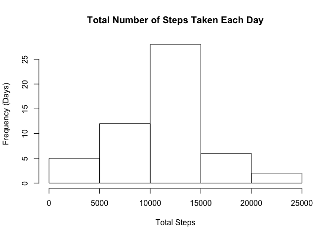
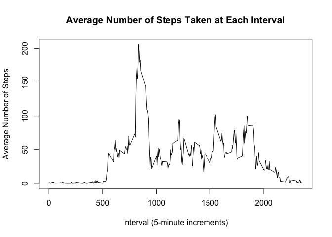
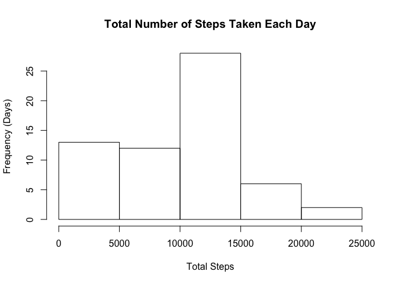
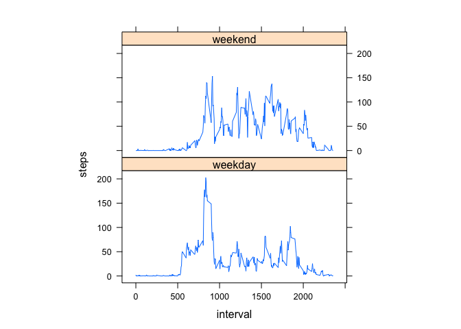

## Loading and preprocessing the data

1. Load the data


```r
workingDir <- "/Users/adam/Documents/Web Projects/Coursera/Reproducible Research/RepData_PeerAssessment1"
archiveFileName <- "activity.zip"
dataFileName <- "activity.csv"

setwd(workingDir)
activity <- read.csv(unz(archiveFileName, dataFileName),header=TRUE)
```

2. Process/transform the data (if necessary) into a format suitable for your analysis


```r
totalSteps<-aggregate(steps~date,data=activity,sum,na.rm=TRUE) # sum all steps for each date; return a data frame
```

## What is mean total number of steps taken per day?

1. Make a histogram of the total number of steps taken each day

```r
hist(totalSteps$steps,main="Total Number of Steps Taken Each Day",xlab="Total Steps",ylab="Frequency (Days)")
```

<!-- -->

2. Calculate and report the mean and median total number of steps taken per day

```r
mean(totalSteps$steps)
```

```
## [1] 10766.19
```

```r
median(totalSteps$steps)
```

```
## [1] 10765
```

* The **mean** total number of steps taken per day is 
    10766.19 steps.
* The **median** total number of steps taken per day is 
    10765 steps.

## What is the average daily activity pattern?

1. Make a time series plot (i.e. type = "l") of the 5-minute interval (x-axis) and the average number of steps taken, averaged across all days (y-axis)


```r
averageStepsPerInterval <- aggregate(steps~interval,data=activity,mean,na.rm=TRUE)
plot(steps~interval,data=averageStepsPerInterval,type="l",main="Average Number of Steps Taken at Each Interval",xlab="Interval (5-minute increments)",ylab="Average Number of Steps")
```

<!-- -->

2. Which 5-minute interval, on average across all the days in the dataset, contains the maximum number of steps?

```r
averageStepsPerInterval[which.max(averageStepsPerInterval$steps),]$interval
```

```
## [1] 835
```

What is the maximum number of averaged steps for the interval above?

```r
format(round(averageStepsPerInterval[which.max(averageStepsPerInterval$steps),]$steps),nsmall=0)
```

```
## [1] "206"
```

It is the **835th** interval, which has 206 averaged steps.

## Imputing missing values

1. Calculate and report the total number of missing values in the dataset (i.e. the total number of rows with NAs)

```r
sum(is.na(activity$steps))
```

```
## [1] 2304
```
A total of **2304** values are missing.

2. Devise a strategy for filling in all of the missing values in the dataset. The strategy does not need to be sophisticated. For example, you could use the mean/median for that day, or the mean for that 5-minute interval, etc.

> I chose to determine the average number of steps for a given date.
> For several dates, no number of steps were recorded. For those dates, the average is just zero (0).


```r
dailyAverageSteps <- function(date){
  meanSteps <- mean(activity[activity$date==date,]$steps)
  if (is.nan(meanSteps) || is.na(meanSteps)) meanSteps <- 0
  as.numeric(format(round(meanSteps),nsmall=0)) # coerce value to numeric, just in case
}
```
  
3. Create a new dataset that is equal to the original dataset but with the missing data filled in.


```r
activityComplete <- activity # New dataset copied from the original

numberEmptyRows <- 0 # Keep a counter of how many NA substitutions were done

for(i in 1:nrow(activityComplete)){
    if(is.na(activityComplete[i,]$steps)){
        activityComplete[i,]$steps<-dailyAverageSteps(activityComplete[i,]$date)
        numberEmptyRows <- numberEmptyRows+1
    }
}
```

A total of 2304 steps containing `NA` were replaced with new values.

4. Make a histogram of the total number of steps taken each day and Calculate and report the mean and median total number of steps taken per day.


```r
totalStepsComplete<-aggregate(steps~date,data=activityComplete,sum)
hist(totalStepsComplete$steps,main="Total Number of Steps Taken Each Day",xlab="Total Steps",ylab="Frequency (Days)")
```

<!-- -->

```r
mean(totalStepsComplete$steps)
```

```
## [1] 9354.23
```

```r
median(totalStepsComplete$steps)
```

```
## [1] 10395
```

* The **mean** total number of steps taken per day is 
9354.23 steps.
* The **median** total number of steps taken per day is 
10395 steps.

5. Do these values differ from the estimates from the first part of the assignment? What is the impact of imputing missing data on the estimates of the total daily number of steps?

> The **mean** value for the data set with the replaced `NA` steps is lower.
> The **median** value for the data set with the replaced `NA` steps is lower.
> This is expected for both values, since all dates that had no steps recorded at all were set to `0` steps.
> Adding more zero values effectively lowers the average and moves the midpoint (median) lower.

## Are there differences in activity patterns between weekdays and weekends?

1. Create a new factor variable in the dataset with two levels -- "weekday" and "weekend" indicating whether a given date is a weekday or weekend day.


```r
activityComplete$day=ifelse(as.POSIXlt(as.Date(activityComplete$date))$wday%%6==0,"weekend","weekday")
activityComplete$day=factor(activityComplete$day,levels=c("weekday","weekend"))
```

2. Make a panel plot containing a time series plot (i.e. type = "l") of the 5-minute interval (x-axis) and the average number of steps taken, averaged across all weekday days or weekend days (y-axis).

```r
averageStepsPerInterval2=aggregate(steps~interval+day,activityComplete,mean)
library(lattice)
xyplot(steps~interval|factor(day),data=averageStepsPerInterval2,aspect=1/2,type="l")
```

<!-- -->
